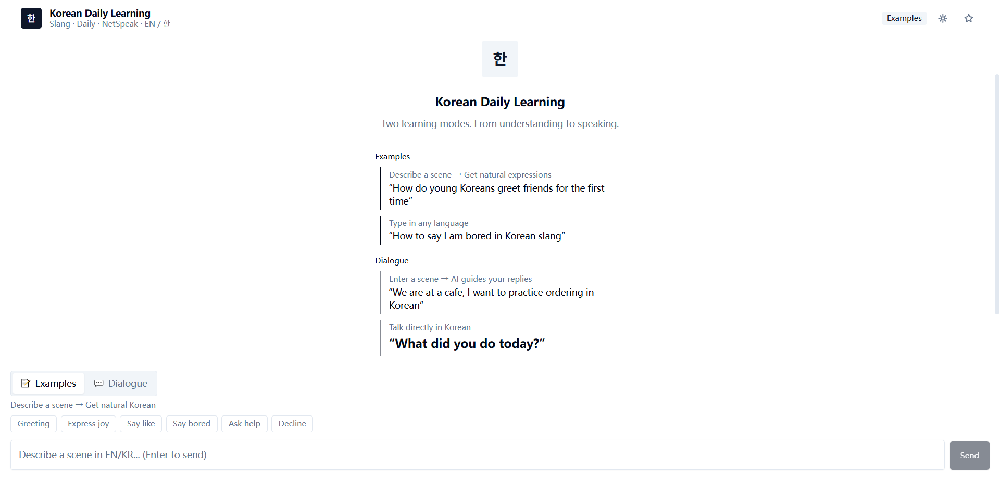

# Real Talk, Real Confidence: Korean Daily Helper

> **Technical Implementation of the Daily Language Learning Model for International Students.**

**Live Demo:** [https://korean-helper-chi.vercel.app](https://korean-helper-chi.vercel.app)  
*(Note: For security reasons, please configure your API Key via the ⚙️ icon in the app to enable AI features.)*

---

## Project Overview
This project is the functional implementation of the **Daily Language Learning Model** proposed in my presentation. It aims to bridge the gap between academic Korean and the actual casual expressions, slang, and net-speak used by young people in Korea today.

##  Key Features

* **Example Mode**: Generates 3 context-specific, natural Korean sentences based on any user-described social scenario (e.g., "Ordering at a trendy cafe").
* **Dialogue Mode**: Interactive social role-play where the AI simulates real-world conversations and suggests appropriate casual replies.
* **Integrated TTS**: Built-in Text-to-Speech to help students master the natural intonation and rhythm of casual Korean.

##  How to Test

The application is a client-side interface that uses an OpenAI-compatible API. To observe the live language generation:

1. Visit the **Live Demo** link above.
2. Click the **Settings (Gear icon ⚙️)** in the header.
3. Enter your **API URL**, **API Key**, and **Model** (e.g., `gpt-4o-mini`).
4. Once saved, the AI interaction will be fully functional.

##  Demonstration

*(Note: If the image above is not visible, please refer to the assets in the repository.)*

## Tech Stack
- **Frontend**: React 18, TypeScript, Vite
- **Styling**: Tailwind CSS, shadcn/ui
- **Deployment**: Vercel

---
**Author**: Gangding Yu (20223309)  
**Context**: Final Project Implementation for the Language Learning Model Proposal.